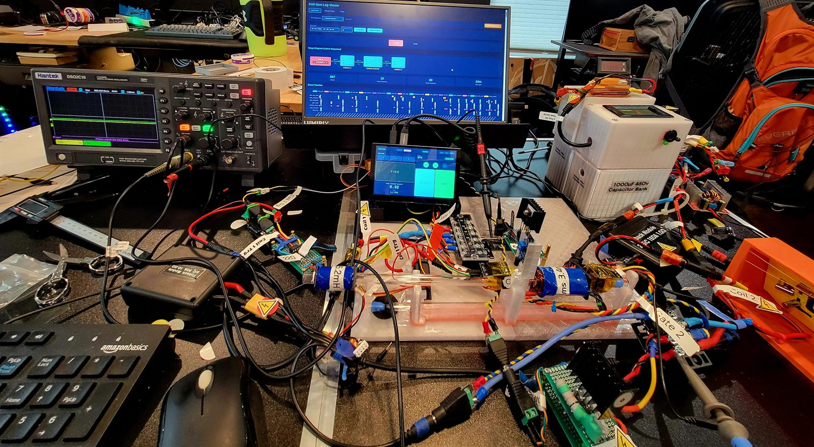

# Iterventions — standing rules

Static site for `iterventions.com`. A maker/engineering blog about **process, not products**.
Hosted on Cloudflare Pages, deployed by GitHub Actions on push to `main`. **No build step.**

The whole site is `index.html` — one file, hash-routed, zero dependencies.

## Where things stand — 2026-07-26

Read this first; it saves re-deriving the state from git and the filesystem.

- **Content is complete for the alpha.** Two project pages (`gauss` v00–v04 ACTIVE,
  `ordinance` v00–v06 MOTHBALLED), 8 sections each, 22 real photographs, 16 bench log entries,
  ~6 MB tracked across 40 files. Preflight GO.
- **Repo is live** at `github.com/troup-miller/iterventions`. `main` and `dev` published.
  Git auth is pinned to account `troup-miller`; pushes are silent.
- **Nothing is deployed.** Cloudflare Pages is not set up at all — no API token, no account ID,
  no repo secrets, no Pages project, no custom domain. `DEPLOY.md` is the from-zero runbook and
  Phases 1, 2, 3, 6 and 7 need a human with a browser.
- **Consequence:** every PR shows a red ✗ because `deploy.yml` runs on `pull_request` and there
  are no secrets. That is expected, not a broken site.
- **Top open work item** is the image lightbox — see *Known gaps* at the bottom.
- `__local/` is 108 MB, gitignored, and exists only on this machine. It is not recoverable from
  the remote. Never delete or replace the working folder without checking it survived.

## Hard constraints

- No CSS frameworks. No JS frameworks. No npm dependencies in the shipped site. No jQuery. No chart library.
- No external image CDNs — images are committed to the repo and served by Pages.
- All design values come from the `:root` token block in `index.html`. **Never write a hex, font name, or raw length outside `:root`.** New colour → add a token first. The JS reads its canvas colours back out of `:root` via `getComputedStyle` for exactly this reason — keep it that way.
- 4px spacing grid. Multiples only. No `margin:5px`.
- Zero border radius anywhere.
- `--c-warn` (#FF6B35) stays orange. Failures here are cautionary, not alarming — **never red**.
- Dark is canonical. No light mode. The print stylesheet is the only light surface.
- Fonts are Space Grotesk + JetBrains Mono, from Google Fonts. Do not substitute without checking metrics.
- No analytics in the alpha. Cloudflare Web Analytics is a one-line add later if wanted.
- Image filenames: `{project}_{version}_{yyyymmdd}_img_{NN}.{ext}`, stored at `/{project}/{version}/`.

## Voice — "irreverent but cautionary"

The site looks competent; the content describes catastrophic failure. **That contrast is the aesthetic.**

| Do | Don't |
|---|---|
| Celebrate the burned capacitor | Apologise for it |
| Show the oscilloscope noise | Crop it out |
| Name the suck-back problem | Soften it to "unexpected behavior" |
| Let failure cards feel slightly raw | Make them look like polished portfolio tiles |
| Use the word "mistake" proudly | Write "learning opportunity" |

Banned phrase: **"learning opportunity."** Euphemism for a failure mechanism is a bug — name the actual mechanism.

**Don't hand the reader a reason to argue about grammar instead of engineering.** Where a technically-correct construction reads as fussy, choose the plain one — write **"dual-axis"**, never "two axes". The prose should never make a correct plural the most interesting thing in the sentence. Singular "pan axis" / "tilt axis" is fine.

**Naming:** PROJECT #001 is titled *Gauss Sequencer* and the machine is called a **coil gun** in body copy — never a rail gun, which is the running joke and the v00 failure card. PROJECT #002 is titled *Residential Ordinance Platform* and its mechanism is a **pan-tilt** in body copy. Route slugs (`gauss`, `ordinance`) and image directories stay as they are; they are not display names.

Every project documents the evolution of *understanding*, not the evolution of hardware. "Next Iteration" is the next engineering **question**, never the next hardware revision.

The recurring narrative, in this order, always:
`Question → Prototype → Failure → Measurement → Understanding → Better Question → Repeat`

## Status vocabulary

Three, and they are stated in the footer legend. Use them consistently on cards, project headers and in copy:

| Status | Means | Colour |
|---|---|---|
| `ACTIVE` | currently teaching me something | accent green |
| `MOTHBALLED` | it taught me its thing and stopped; rig intact, on a shelf | inactive greys (`--c-border-hi` / `--c-text-lo`) |
| `FINISHED` | never used. It is in the legend as a joke and must stay unused | warn orange |

A mothballed project keeps its page, its route and its open Next Iteration question — mothballed is not archived and not hidden. Its version chip reads `VNN LAST`, not `VNN CURRENT`.

## Structure

Hash routes: `#home`, `#log`, and one per project — `#project/gauss`, `#project/ordinance`. Bare `#project` is a legacy alias resolving to the first project. Unknown hashes fall back to `#home`. `#sec-*` fragments are **in-page anchors, not routes** — the router explicitly ignores them, and removing that guard makes every sub-nav click bounce to the home page.

Section ids are namespaced per project (`#sec-question` for gauss, `#sec-ord-question` for ordinance) because ids must be unique across the whole document — the scroll-spy observes `.sec[id]` globally.

Every project page carries the same eight numbered sections, in order:

1. The Question — one motivating engineering question
2. Evolution Timeline — `<details>` per version, ascending, v00 open by default
3. Prototype Passport — exactly six rows: Version, Date, Hypothesis, Major Change, Unexpected Discovery, Next Experiment
4. Failure Gallery — per card: Expected, Actually Happened, (image), Lesson, Repeat it?
5. Data Notebook — scope charts, plates, bench notebook block; images chronological
6. AI Lab Notebook — per entry: Question, Dataset, AI Analysis, Decision
7. Current Understanding — plainly stated, subject to revision on contact with data
8. Next Iteration — the next engineering question, written before anything is built

## Images

Both projects are photographed. 22 images live under `gauss/v00..v04/` and `ordinance/v00..v06/`, all real, all committed. Every slot placeholder has been replaced by an ``.

```html

```

`alt`, `loading="lazy"`, `class="slot__img"` and explicit `width`/`height` are all required, and the dimensions must be the file's **true intrinsic size** or the page shifts on load.

Source photos live in `__local/projects/{coil_gun,pan_tilt_platform}/` at 2–9 MB each. **Never commit those.** Resize to 1500–1600 px on the long edge at JPEG quality 76–82, which lands each file between 100 and 450 KB. The `.slot` placeholder CSS is kept for the next project, which starts empty.

## The scope trace

The iteration-loop canvas dwells **2600 ms on Failure** against 900 ms for every other step. That is deliberate and it is the joke. Do not shorten it. Cycle length is 7040 ms including the 420 ms flyback.

## Before changing visuals

Read `__local/design_handoff_iterventions_alpha/README.md` first. It is the spec for every measurement, colour and motion timing on the site, and `__local/design_handoff_iterventions_alpha/design/Iterventions.dc.html` is the design source of truth.

`__local/` is gitignored and must never be deployed — it is a 425 KB design prototype.

## Branching

`main` is production — Cloudflare Pages deploys from it. `dev` is the integration branch.
**Keep `main`'s history clean at all times.**

- Work happens on a feature branch cut from `dev`, named `kind/short-slug`
  (`feat/`, `fix/`, `docs/`, `chore/`).
- Publish the branch, open a PR into `dev`, merge with a **merge commit**.
- `dev` → `main` is also a PR. Never push straight to `main`.
- Rebase the feature branch on `dev` before merging rather than merging `dev` down into it —
  that keeps the graph readable.

Claude has standing authority to push and reset `dev` and any feature branch. `main` is
by PR only.

Note: `.github/workflows/deploy.yml` triggers on `pull_request` as well as on push to `main`,
so every PR runs a deploy job. Until the Cloudflare secrets exist it fails — a red X on a PR
right now means "no credentials", not "broken site". See `DEPLOY.md`.

## Agents

Specialised charters live in `.claude/agents/`. Use them:

| Agent | Use when |
|---|---|
| `token-warden` | Any visual change — audits token discipline before it lands |
| `project-scribe` | Adding a project, or a new version to an existing project |
| `log-keeper` | Adding a bench log entry |
| `asset-curator` | Photographs arrive and need naming, placing, and slot replacement |
| `deploy-preflight` | Before pushing to `main` |

## Known gaps (alpha → beta)

Ranked. See the handoff's *Remaining work* for detail.

1. ~~Mobile nav drawer~~ — done
2. ~~Scroll-spy on the project sub-nav~~ — done
3. **Image lightbox** — not built, and now the top gap. 22 photographs are live and several reward a closer look. Needs `←`/`→`/`Esc` and a caption showing the filename. Vanilla only.
4. ~~On-scroll reveals~~ — done (convention tiles)
5. ~~`prefers-reduced-motion`~~ — done
6. ~~PROJECT #002 page~~ — done. Eight sections, seven versions, mothballed at v06.
7. ~~Per-project routes~~ — done. `#project/gauss` and `#project/ordinance`; bare `#project` is an alias.
8. ~~Real `<head>`~~ — done (OG, Twitter card, canonical, description)

Also open:

- `_headers` sets immutable caching for `*.jpg`/`*.png` only — add `*.webp`/`*.svg` rules if those formats get used.
- There is a firing video at `__local/projects/coil_gun/project_images_unsorted/20260726_135349.mp4` (7.8 MB). Not shipped — the site has no video component and no `_headers` rule for it. Worth building deliberately, not by accident.
- The three `DATA PTS` figures on the home cards are the only numbers on the site not directly traceable to a photograph or a log entry.
